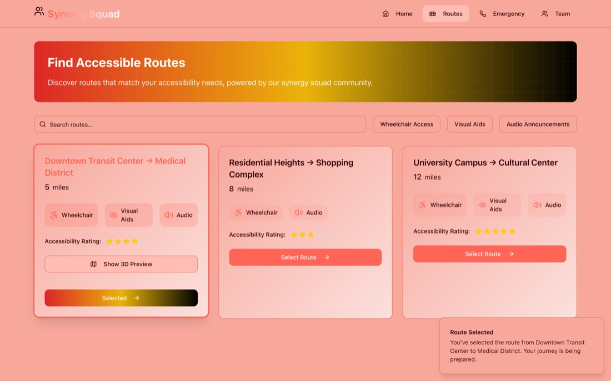
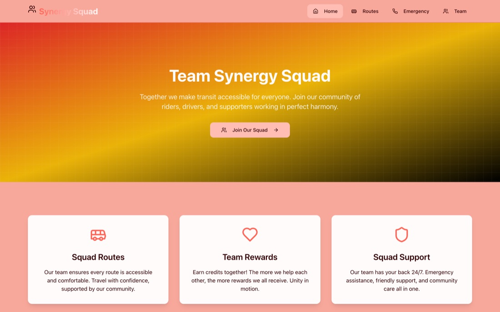
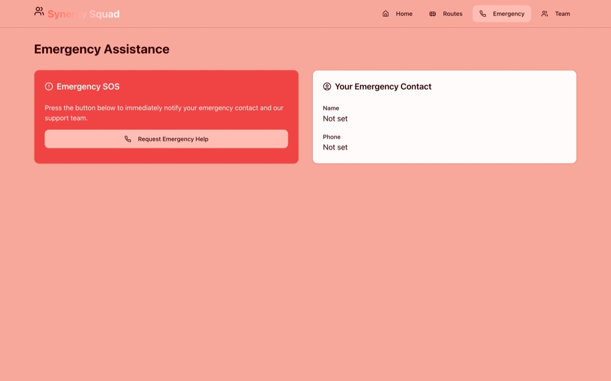

<div align="center">

# AccessibleTransit · Synergy Squad

**Public transit for everyone. Find routes that match your accessibility needs, preview the journey in 3D, and reach help with one tap.**




</div>

---

## The problem

For riders who use a wheelchair, have low vision or rely on audio cues, "how do I get there?" is only half the question. The other half is *"can I actually take that route?"* Most trip planners don't answer it.

## What Synergy Squad does

| | |
|---|---|
| ♿ **Accessibility-first route search** | Search by start or destination and filter by **wheelchair access**, **visual aids** and **audio announcements**. Only routes that meet every need you select are shown. |
| ⭐ **Community accessibility ratings** | Every route carries a 5-star accessibility rating, so riders know what to expect before they leave. |
| 🗺️ **3D street preview** | Select a route and open a tilted Mapbox view with extruded 3D buildings to get familiar with the area in advance. |
| 🆘 **One-tap emergency SOS** | A dedicated Emergency page shows your saved emergency contact and a single **Request Emergency Help** button. In this prototype the alert is a demo flow that confirms on screen; no real message is sent yet. |
| 🤝 **Squad rewards** | Riders, drivers and supporters earn credits for helping each other travel. |

<p align="center">
  
  
</p>

## Tech stack

- **Client:** React + TypeScript (Vite), Wouter routing, TanStack Query, Tailwind CSS with shadcn/ui components, Mapbox GL.
- **Server:** Express API (`/api/routes`, `/api/users`, `/api/feedback`) with security headers (HSTS and others) and a shared Zod/Drizzle schema.
- **Data:** an in-memory store for demos. The Drizzle schema is ready for Postgres (`npm run db:push`).

## Run it locally

```sh
npm install
npm run dev            # Express + Vite on http://localhost:5000
```

For the 3D preview, add a Mapbox token:

```sh
echo "VITE_MAPBOX_TOKEN=your-mapbox-token" > .env
```

## About

Built by **Roszhan Raj** as part of the *Synergy Squad* accessible-transit concept.
